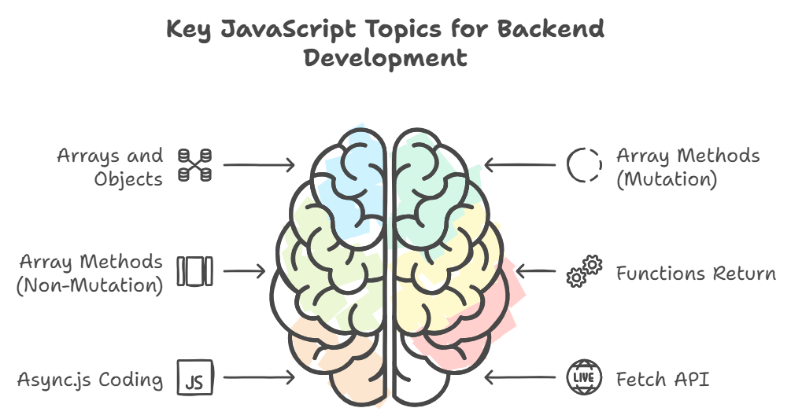
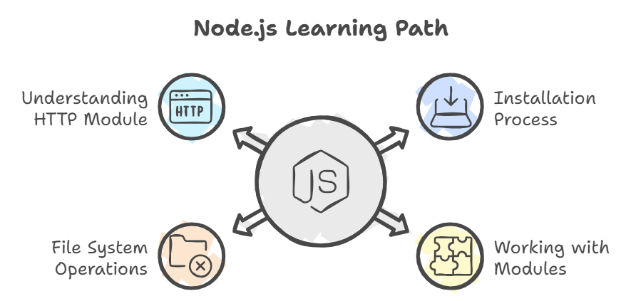
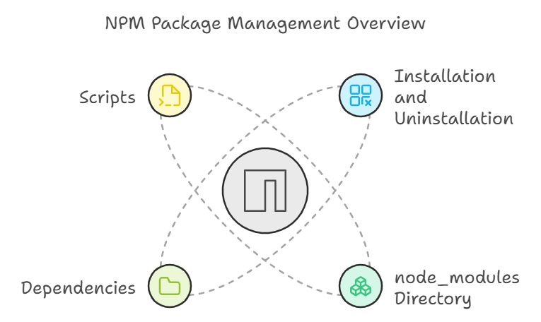

# 🚀 Level 1 - Important JavaScript Topics  

Before diving into the backend development journey, it's crucial to have a solid understanding of key JavaScript concepts. Here's a checklist to guide your learning process:  

  

---

## 📝 Next Steps  

**Pro Tip:** Be sure to thoroughly explore the `Docs` and `JavaScript` folders before advancing to the next level.  

---

# 🤖 Level 2 - Node.js  

  

  

---

## 📝 Next Steps  

**Pro Tip:** Take the time to review the `Node` folder carefully before moving forward.  

---

# 🎃 Happy Coding!  
